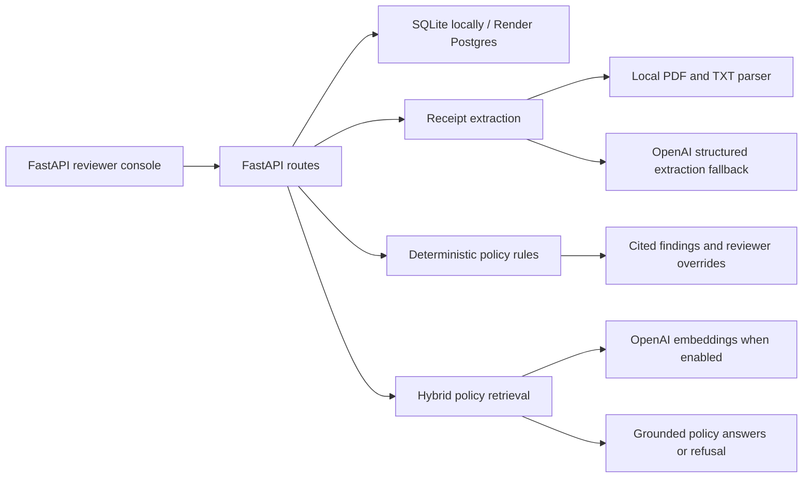

# Northwind Logistics Expense Pre-Review

## Submission links

- Live demo: [`https://northwind-expense-review.onrender.com`](https://northwind-expense-review.onrender.com)
- Source code: [`https://github.com/Balavardhanreddysheelam/northwind-expense-review`](https://github.com/Balavardhanreddysheelam/northwind-expense-review)

## Problem

Expense review has two different failure modes:

1. Receipts are semi-structured documents. Relevant fields can be missing, scanned, or formatted inconsistently.
2. Travel policy is explicit. A reviewer needs the exact clause behind a finding, not an unsupported model opinion.

The application handles those concerns separately. It extracts receipt evidence, applies deterministic rules, cites stored policy text, and leaves the final decision with the finance reviewer.

## Implemented workflow

1. A reviewer creates a submission and uploads PDF, JPG, PNG, or TXT receipts.
2. Text-readable PDF and TXT receipts are parsed locally.
3. Image receipts, scanned PDFs, and ambiguous documents use a structured OpenAI extraction fallback.
4. The server applies Python rules for meals, alcohol, lodging, airfare, rideshare, required receipt fields, conference-included meals, and approval routing.
5. Every finding includes the policy document ID, section, and an exact quote from the indexed policy corpus.
6. Reviewers can override a verdict only with a comment. Overrides are timestamped and persisted.
7. The policy assistant returns cited policy chunks or refuses questions that are not supported by the policy library.

## Architecture



## Design choices

### Models extract evidence; code makes explicit decisions

The model is not asked whether an expense should be reimbursed when the policy rule can be expressed directly. This keeps review behavior testable and limits model variability.

### Quotes come from stored policy chunks

The application does not trust generated quotations. Rules select a policy document and section, and the server returns text from the indexed corpus. The evaluation endpoint checks that displayed quotes exist verbatim in stored policy text.

### Incomplete evidence does not pass

Low-confidence extraction, missing required fields, and provider failures result in `needs_review`. Provider error details are logged server-side and are not exposed in reviewer output.

### Postgres stores review state

The Render deployment uses Postgres for submissions, receipt bytes, extracted facts, findings, policy chunks, policy-question audit rows, and reviewer overrides. This avoids relying on Render's ephemeral web-service filesystem.

## Verification evidence

The repository includes focused tests and a small evaluation harness:

```powershell
$env:ENABLE_EMBEDDINGS="false"
pytest -q
python scripts/smoke_report.py
python scripts/evaluate.py --dataset eval/sample_eval.json --base-url http://127.0.0.1:8000
```

The local smoke dataset checks these expected patterns:

| Scenario | Expected result |
|---|---|
| Denver baseline | Compliant |
| Boston conference lunch | Flagged because registration includes lunch |
| Chicago dinner | Flagged because the meal exceeds the cap |
| Austin dinner | Flagged because solo-travel alcohol is not reimbursable |
| Seattle lodging | Flagged for the nightly cap and reviewed for outside-tool booking |

The included evaluation dataset reports category accuracy, verdict accuracy, violation recall, false-flag rate, retrieval recall, citation faithfulness, refusal accuracy, extraction completeness, and latency. It is a regression harness, not a production benchmark.

Live health check verified on May 30, 2026:

```json
{"status":"ok"}
```

## Public repository boundary

The supplied hiring-team attachments are excluded from the public Git repository. The deployed demo uses synthetic policies, employees, and receipts from `app/public_demo.py`. Reviewers can upload held-out documents through the browser without publishing the evaluation package.

## Scale path

For a larger workload:

1. Move receipt bytes to encrypted object storage and keep object keys in Postgres.
2. Process extraction through a durable queue with retry and dead-letter handling.
3. Cache policy embeddings by policy version.
4. Add `pgvector` when policy volume or tenant count requires database-side vector search.
5. Add authentication, tenant isolation, malware scanning, rate limits, audit export, and structured observability.

## Current limits

- Text-readable receipts have the strongest local extraction path. Image and scanned receipts depend on the configured OpenAI key.
- Receipt processing is synchronous in this case-study build.
- The public demo dataset is synthetic. It demonstrates behavior without publishing the private evaluation package.
- Free Render web services sleep after inactivity, and free Render Postgres databases expire after 30 days.
