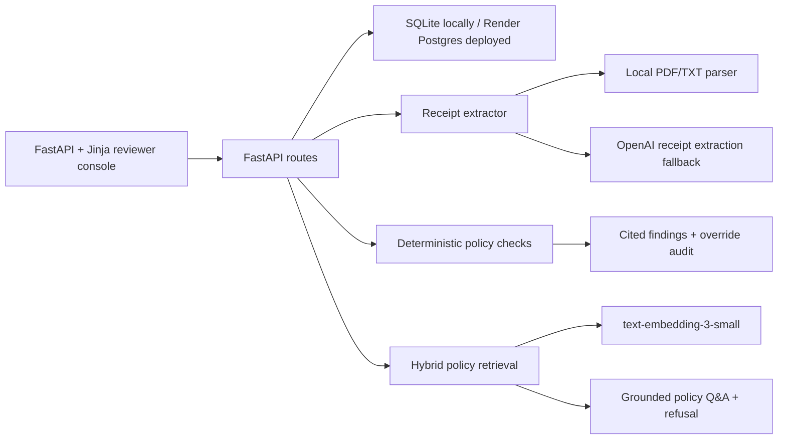

# Northwind Logistics Expense Pre-Review

A finance-review application for receipt extraction, policy checks, cited findings, reviewer overrides, submission history, and policy questions.

The application separates extraction from judgment. OpenAI models handle image receipts and policy embeddings. Explicit policy rules run in Python. Missing or low-confidence evidence becomes `needs_review`, never `compliant`.

Live demo: [`https://northwind-expense-review.onrender.com`](https://northwind-expense-review.onrender.com)

The public repository intentionally excludes the team attachments and private evaluation package. When those local files are absent, startup loads an independently generated synthetic demo dataset from `app/public_demo.py`. Evaluators can upload held-out receipts through the browser or evaluation API.

## Run locally

Requires Python 3.12 and an optional OpenAI API key.

```powershell
py -3.12 -m venv .venv
.\.venv\Scripts\Activate.ps1
pip install -r requirements.txt
Copy-Item .env.example .env
$env:OPENAI_API_KEY="your-key"
uvicorn app.main:app --reload
```

Open `http://127.0.0.1:8000`. On first startup, the app creates its database, indexes the supplied policies, loads the five employees, and pre-reviews the supplied submissions. To run without external model calls during development, set `$env:ENABLE_EMBEDDINGS="false"`. Text-readable PDF and TXT receipts still process locally; image and scanned-PDF receipts conservatively become `needs_review` if no model is available.

Run verification:

```powershell
$env:ENABLE_EMBEDDINGS="false"
pytest -q
python scripts/smoke_report.py
python scripts/evaluate.py --dataset eval/sample_eval.json --base-url http://127.0.0.1:8000
```

## Architecture



The code separates three concerns:

1. **Evidence extraction:** text-readable PDFs and TXT files take a local parsing path. JPG, PNG, scanned PDF, and ambiguous evidence fall back to OpenAI vision with a Pydantic schema.
2. **Policy retrieval:** the 30 policy documents are parsed by document ID and numbered section. Retrieval combines lexical matching, document-ID boosts, and stored OpenAI embeddings when available.
3. **Judgment:** explicit expense rules are deterministic. Findings cite server-selected policy chunks, and every displayed quote is checked against indexed source text. Low-confidence evidence never silently passes.

## Reviewer workflow

- Dashboard: see compliant, flagged, and needs-review counts.
- New submission: choose a seeded employee or create one, then upload PDF, JPG, PNG, and TXT receipts together.
- Submission review: inspect category, amount, verdict, confidence, rationale, exact policy quotation, original receipt, and approval route.
- Override: change any verdict with a required comment. The timestamped audit trail survives restarts.
- History: filter submissions by employee, date, and status.
- Policy assistant: ask ad-hoc questions; unsupported questions are declined rather than fabricated.

## Deliberate tradeoffs

### Why direct SDK calls instead of LangChain?

This application has a narrow retrieval surface and strict audit requirements. Direct OpenAI SDK calls keep schema validation, citation ownership, and failure handling visible in code. A framework would add abstraction without reducing meaningful complexity here.

### Why deterministic rules after extraction?

Meal caps, lodging tiers, solo-alcohol restrictions, conference-included meals, premium-flight thresholds, and approval routing are explicit. Python rules are easier to test and audit than asking a model to reinterpret those clauses for every receipt. The model is reserved for image receipts and incomplete local extraction.

### Why SQLite locally and Postgres in the demo?

SQLite minimizes setup for reviewers running locally. Render Postgres provides restart persistence for the live URL. Receipt bytes are stored in the database for this case study because Render web-service filesystems are ephemeral. At production scale they move to object storage.

### Why extractive policy answers?

The assistant retrieves and displays exact policy chunks instead of generating polished but potentially unsupported prose. The refusal gate requires substantial query-term support before returning clauses. A production version can add a constrained summarization step while retaining quote validation.

## Rules implemented

- Meal caps with Tier 1 high-cost-city uplift
- Solo or team-only alcohol review
- Tip cap review
- Lodging city-tier caps and outside-Concur approval review
- Premium-economy eligibility review
- Premium rideshare review
- Receipt completeness review
- Cross-receipt conference-included meal review
- Submission-total approval routing

## Evaluation harness

Run:

```powershell
python scripts/evaluate.py --dataset eval/sample_eval.json --base-url http://127.0.0.1:8000
```

The held-out JSON format is demonstrated in [`eval/sample_eval.json`](eval/sample_eval.json). Each receipt case contains source text, expected category, expected verdict, expected policy references, and required extracted fields. Each policy-question case contains the question, expected refusal decision, and optional expected references.

The harness reports:

- category accuracy
- verdict accuracy
- violation recall
- false-flag rate
- retrieval recall@k
- citation faithfulness
- out-of-scope refusal accuracy
- extraction completeness
- mean latency

## Verification evidence

The release was tested before packaging:

- `pytest -q`: focused tests cover the supplied sample pattern, faithful citations, refusal behavior, unsafe file rejection, JPG/PNG conservative fallback, provider-error redaction, download filename sanitization, parser regression coverage, and Render Postgres URL normalization.
- `python scripts/smoke_report.py`: Denver remained compliant; Boston flagged the conference-included lunch; Chicago flagged the dinner cap; Austin flagged solo alcohol; Seattle flagged the lodging cap and outside-Concur booking.
- `python scripts/evaluate.py --dataset eval/sample_eval.json --base-url http://127.0.0.1:8000`: the included sanity dataset reported `1.0` for category accuracy, verdict accuracy, violation recall, retrieval recall, citation faithfulness, refusal accuracy, and extraction completeness. This is a wiring check, not a claimed production benchmark.
- Restart proof: a reviewer override remained visible after stopping and relaunching the server, then the verification-only override was removed.
- Real provider contract: `text-embedding-3-small` returned 1,536 dimensions; `gpt-5.4-mini-2026-03-17` parsed generated PNG and JPG receipts as `SAMPLE CAFE`, `meal`, `$24.00`, confidence `0.98`; a synthetic blank PDF returned `unknown` with missing fields instead of fabricated facts.

## Cost and scale

The supplied 34 text-readable PDFs use the local parser, so the smoke run performs **zero receipt-model calls**. Policy embeddings are a one-time indexing cost when enabled. For scanned or image receipts, the configured fallback is `gpt-5.4-mini-2026-03-17`; `text-embedding-3-small` handles retrieval. Actual cost depends on page-image tokens and output size. A rough eight-receipt scanned submission budget of 24,000 input tokens and 4,000 output tokens is about **$0.04** at the documented model rates before retries.

For 10,000 submissions per day:

- upload receipt bytes to object storage and keep object keys in Postgres
- enqueue extraction jobs and process them with horizontally scalable workers
- cache policy embeddings and retrieved clauses by policy version
- add `pgvector` when the policy corpus or tenant count grows
- batch embedding jobs, meter model usage, and add retry/dead-letter handling
- add authentication, tenant isolation, object-store encryption, and retention controls

## Deploy on Render

The live demo is available at [`https://northwind-expense-review.onrender.com`](https://northwind-expense-review.onrender.com). The repository includes [`render.yaml`](render.yaml), which provisions the FastAPI web service and Postgres database. Free Render web services can take about one minute to wake after inactivity, and free Postgres databases expire after 30 days; upgrade them if the review window requires stronger availability.

The exact Dashboard steps, expected resources, environment variables, and live smoke checks are listed in [`DEPLOYMENT_HANDOFF.md`](DEPLOYMENT_HANDOFF.md).

For a reviewer-oriented summary of the design, evidence, tradeoffs, and scale path, see [`CASE_STUDY.md`](CASE_STUDY.md).

## Limitations and next work

- Local extraction is optimized for text-readable receipts. Images and scans need the configured OpenAI vision fallback.
- The demo processes receipts synchronously. Production processing belongs on a durable queue.
- Postgres blob storage is appropriate for the case-study deployment, not high-volume receipt retention.
- The assistant is extractive. Add constrained synthesis and retrieval eval expansion after establishing a labeled policy-question set.
- Add authentication, authorization, malware scanning, rate limits, and structured observability before production use.
